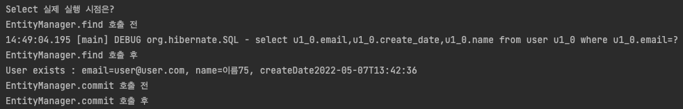
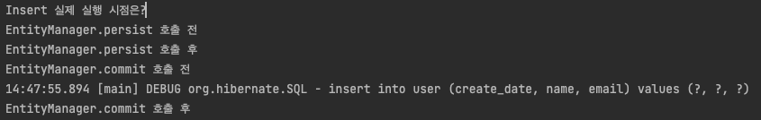
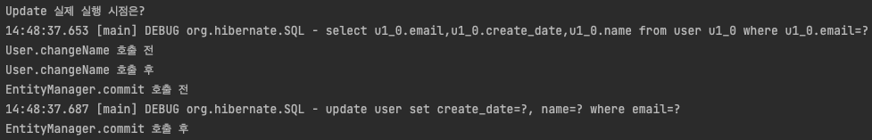
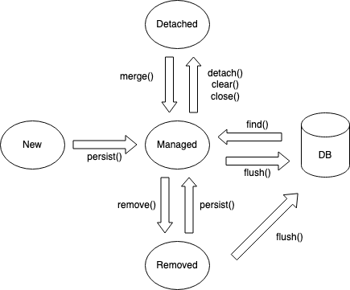
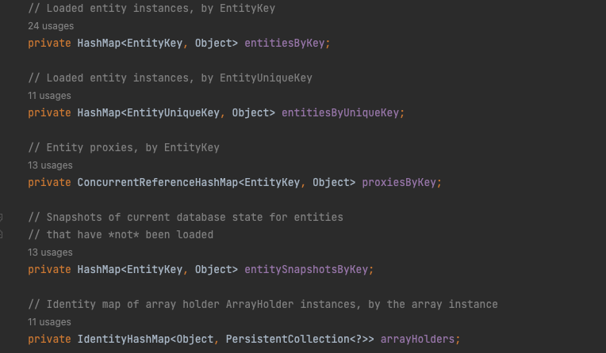

# JPA 02

## 각 Query 실행 시점

**Select**


**Insert/Update**

transaction Commit 시 Query가 실행되는 것을 알 수 있다.

- Insert



- Update




## PersistenceContext

- DB에서 읽어온 엔티티 또는 EntityManager를 통해 읽어오거나 저장한 엔티티를 보관하는 일종의 메모리 공간
- 역할 : 영속 객체를 보관하고 있다가 Commit하는 시점에 PersistenceContext 의 변경 내역을 DB에 반영
- persist 메서드 호출 도는 변경이 되었을 때에는 DB의 변경이 아니라 PersistenceContext에 Entity의 변경사항이 저장되는 것이다.
- PersistenceContext는 하나만 존재함. 즉 EntityManager와는 N:1 의 관계.

### Entity 생명 주기




- new/transient (비영속) : PersistenceContext 와 전혀 관계가 없는 새로 생긴 상태
  - 객체를 생성했으나, 아직 EntityManager에 의해 관리되지 않는 상태
  
  - ```java
    User user = new User("user@user.com", "user01", LocalDateTime.now());
    ```
  
- managed (영속) : EntityManager에 의해 PersistenceContext에서 관리되는 상태

  - ```java
    User user = new User("user@user.com", "user01", LocalDateTime.now());
    entityManager.persist(user);
    ```

- detached (준영속) : PersistenceContext에 저장되었다가 분리된 상태

  - ```java
    entityManager.detach(user);
    ```

  - EntityManager가 제공하는 기능을 사용할 수 없음.

  - 변경된 내역을 추적하지 않음.

- removed (삭제) : 삭제된 상태

  - ```java
    entityManager.remove(user);
    ```


### PersistenceContext의 특징

- PersistenceContext는 엔티티를 식별자 값으로 구분한다. 즉, 영속 상태는 식별자 값이 존재해야 한다. (Map<Key, EntityObject> 형태)

  - org.hibernate.engine.internal.StatefulPersistenceContext.java
  - 

- PersistenceContext에 저장된 엔티티는 트랜잭션을 commit 하는 순간 DB에 반영되며, 이것을 flush 라 함.

- PersistenceContext의 장점

  - 1차 캐시로서의 역할

    - 내부의 Map 형태의 자료구조에 엔티티를 저장하는 형태. 
    - Key = @Id로 매핑한 식별자, Value = 엔티티 객체
    - 이미 PersistenceContext에 있는 경우 DB에서 조회하는 것이 아니라 PersistenceContext의 값을 조회함

  - 객체의 동일성 보장

    - 트랜잭션 내 동일한 쿼리로 조회한 객체는 동일성을 유지

  - 쓰기 지연 지원

    - persist/remove 등 변화를 일으키는 메서드를 호출할 때마다 쓰기 지연 SQL 저장소에 쿼리를 쌓아둠
    - commit() 수행 시 commit() 호출 후 flush() 가 호출되며, 이때 JDBC Batch를 통해 쓰기 지연 SQL 저장소에 쌓인 쿼리들이 실행됨.

  - Dirty Checking 지원

    - EntityManager에 의해 관리되는 객체의 변경은 자동으로 감지되어, 엔티티 수정후 별도의 update 쿼리를 호출하지 않아도 됨.
    - commit() 수행 후 내부적으로 아래와 같은 과정이 수행됨
      - flush() 메서드 호출
      - flush가 일어날 때 엔티티와 기존 스냅샷에 저장된 엔티티를 비교
      - 변경 내용이 있을 경우 UPDATE 쿼리 생성 후 쓰기 지연 SQL 저장소에 저장
      - 쓰기지연 쿼리를 DB에 전송
      - DB 트랜잭션 커밋
    - 영속상태의 엔티티에 대해서만 적용되며, 비영속, 준영속 상태의 엔티티는 적용되지 않음
    - 변경감지로 생성된 UPDATE SQL은 모든 필드에 대한 업데이트 구문을 생성함.
      - 전송량이 증가하는 단점이 존재함
      - 어플리케이션 로딩 시점에 수정 쿼리를 미리 생성하고 재사용이 가능한 장점이 있음.
      - DB에 동일한 쿼리 전송 시 DB는 이전에 한번 파싱된 쿼리를 재사용할 수 있는 장점이 있음.
      - @DynamicUpdate - 변경된 필드만 반영되도록 쿼리를 생성하게 하는 애노테이션

  - Lazy Loading 지원

    - 객체 내 또다른 객체가 있는 형태의 엔티티의 경우, 그 또다른 객체가 필요한 시점에 정보를 불러오는 것.

    - 필드가 많을 경우 성능 최적화의 이점을 가져갈 수 있음

    - ```java
      @Entity
      public class User {
        @Id
        private String email;
        private String password;
        @OneToMany
        private Subscription subscription; // Lazy Loading 대상
      }
      ```


**Flush 메서드**

- EntityManager에 의해 변경된 Entity의 변경 내용을 DB에 반영하는 메서드
- flush는 변경감지, 쓰기지연SQL저장소의 쿼리를 DB에 전송하는 경우에 발생. (CUD 쿼리)
- flush 하는 방법
  - flush 직접 호출 
  - transaction.commit() : 자동 호출됨.
  - JPQL 쿼리 실행 : flush 자동 호출됨.
