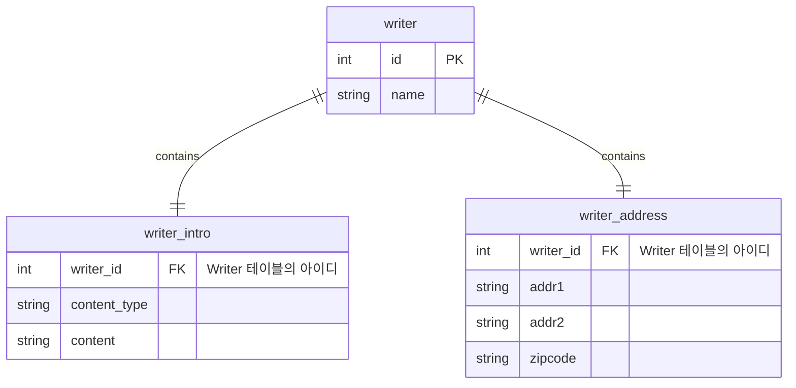

# Embeddable 다른 테이블에 매핑하기

테이블간의 관계가 1:1 일 경우 종종 사용된다.

## ER Diagram




## 방법 1.  @SecondaryTable + 테이블 명

```java
@Embeddable
public class Intro {
    @Column (table ="writer_intro",
    name = "content_type")
    private String contentType;
    
    @Column (table = "writer_intro")
    private String content;
}
```

```java
@Entity
@SecondaryTable(name = "writer_intro",
    pkJoinColumns = @PrimaryKeyJoinColumn(
            name="writer_id",
            referencedColumnName = "id"
    )
)
public class Writer {
    @Embedded
    private Intro intro;
}
```
위와 같이 하면 writer, writer_intro 라는 두개의 테이블이 생성됨.


- pkJoinColumns
  - name : SecondaryTable의 컬럼명
  - referencedColumnName : 현재 테이블에서 Secondary Table의 조인 컬럼과 매칭되는 컬럼


## 방법 2. @SecondaryTable + @AttributeOverride

```java
@Emdeddable
public class Address {
  @Column(name = "addr1")
  private String address1;
  
  @Column(name = "addr2")
  private String address2;
  
  @Column(name = "zipcode")
  private String zipcode;
}
```

```java
@Entity
@SecondaryTables({
  @SecondaryTable(name = "writer_address",
                 pkJoinColumns @PrimaryKeyJoinColumn(name="writer_id",
                                                    referencedColumnName = "id")
                 ),
  ...
})
public class Writer {
  @Embedded
  @AttributeOverrides({
    @AttributeOverride(name = "address1", column = @Column(table = "writer_address", name = "addr1")),
    @AttributeOverride(name = "address2", column = @Column(table = "writer_address", name = "addr2")),
    @AttributeOverride(name = "zipcode", column = @Column(table = "writer_address"))
  })
  private Address address;
  ...
}
```


## 저장

**모든 필드를 채웠을 때 **

1. 코드 실행 내용

   ```java
   Writer w = new Writer("name",
                        new Address("주소1", "주소2", "12345"),
                        new Intro("text/plain", "소개글"));
   em.persist(w);
   ```

2. 코드 실행 시 실제 생성되는 쿼리

   ```sql
   insert into writer (name) values (?)
   insert into writer_address(addr1, addr2, zipcode, writer_id) values (?, ?, ?, ?)
   insert into writer_intro(content, content_type, writer_id) values (?, ?, ?)
   ```

   

**특정 필드를 비웠을 때**

1. 코드 실행 내용

   ```java
   Writer w = new Writer("name",
                        new Address("주소1", "주소2", "12345"),
                        null);
   em.persist(w);
   ```

2. 코드 실행 시 실제 생성되는 쿼리

   ```sql
   insert into writer (name) values (?)
   insert into writer_address(addr1, addr2, zipcode, writer_id) values (?, ?, ?, ?)
   ```


## 조회

LEFT JOIN을 이용해서 Embeddable table들을 불러오는 것을 확인할 수 있다. 

INNER JOIN을 이용할 경우 writer_intro 또는 writer_address가 비어있다면 writer의 결과도 안나올 수 있기 때문이다.

1. 코드 실행 내용

   ```java
   Writer writer = em.find(Writer.class, id);
   ```

2. 코드 실행 시 실제 생성되는 쿼리

   ```sql
   select w1_0.id, w1_0.name, w1_1.addr1, w1_1.addr2 ....
   from writer w1_0
   left join writer_address w1_1 on w1_0.id = w1_1.writer_id
   left join writer_intro w1_2 on w1_0.id = w1_2.writer_id
   where w1_0.id=?
   ```


## 변경

**Address를 Not null로 변경할 때**

1. 코드 실행 내용

   ```java
   Writer writer = em.find(Writer.class, id);
   writer.setAddress(new Address("신주소1", "신주소2", "12345"));
   ```

2. 코드 실행 시 실제 생성되는 쿼리

   ```sql
   // address가 null이 아닐 경우
   update writer_address set addr1=?, addr2=?, zipcode=? where writer_id = ?
   // address 가 null일 경우
   insert into writer address (addr1, addr2, zipcode, writer_id) values(?, ?, ?, ?)
   ```

   

**Address를 null로 변경할 때**

1. 코드 실행 내용

   ```java
   Writer writer = em.find(Writer.class, id);
   writer.setAddress(null);
   ```

2. 코드 실행 시 실제 생성되는 쿼리

   ```sql
   // null 이 아니었을 떄 delete 쿼리 실행
   delete from writer_address where writer_id=?
   ```


## 삭제

1. 코드 실행 내용

   ```java
   Writer writer = em.find(Writer.class, id);
   em.remove(writer);
   ```

2. 실제 실행 쿼리

   ```sql
   delete from writer_intro where writer_id=?
   delete from writer_address where writer_id=?
   delete from writer where id=?
   ```

   
