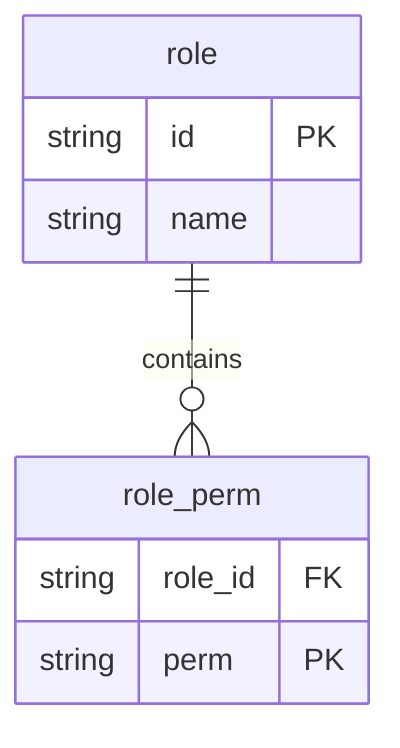

# Set 매핑

## ERD



## 단순 값 Set 매핑

```java
@Entity
@Table(name = "role")
public class Role {
    @Id
    private String id;
    private String name;

    @ElementCollection
    @CollectionTable(
            name = "role_perm",
            joinColumns = @JoinColumn(name = "role_id")
    )
    @Column(name = "perm")
    private Set<String> permissions = new HashSet<>();
}
```


### 저장

1. 실행 코드

   ```java
   Role role = new Role(roleId, "관리자", Set.of("F1", "F2"));
   em.persist(role);
   ```

2. 실제 실행되는 쿼리

   ```sql
   insert into role (name, id) values (?, ?)
   insert into role_perm(role_id, perm) values(?, ?)
   insert into role_perm(role_id, perm) values(?, ?)
   ```

   

### 조회 (Lazy)

1. 실행 코드

   ```java
   Role role = em.find(Role.class, roleId); // -- 1
   for(String perm : role.getPermissions()) { // -- 2
     ...
   }
   ```

2. 실행쿼리 1번

   ```sql
   select r1_0.id, r1_0.name
   from role r1_0 where r1_0.id=?
   ```

3. 실행쿼리 2번

   ```sql
   select p1_0.role_id, p1_0.perm
   from role_perm p1_0 where p1_0.role_id=?
   ```


### 조회 (Eager)

1. 엔티티 형태

   ```java
   @ElementCollection(fetch=FetchType.EAGER)
   @CollectionTable(...)
   @Column(name="perm")
   private Set<String> permissions = new HashSet<>();
   ```

2. 실행 코드

   ```java
   Role role = em.find(Role.class, roleId); // -- 1
   for(String perm : role.getPermissions()) { // -- 2
     ...
   }
   ```

3. 실행 쿼리

   ```sql
   select r1_0.id, r1_0.name, p1_0.role_id, p1_0.perm
   from role r1_0
   left join role_perm p1+0 on r1_0.id = p1_0.role_id
   where r1_0.id=?
   ```


### 수정

1. 실행 코드

   ```java
   Role role = em.find(Role.class, roleId);
   role.getPermissions().add("E3");
   role.getPermissions().remove("F1");
   ```

2. 실행 쿼리

   ```sql
   delete from role_perm where role_id=? and perm=?
   insert into role_perm (role_id, perm) values (?, ?)
   ```

   1. delete 부터 먼저 실행이 된다.


### Set을 아예 새로 할당

1. 실행 코드

   ```java
   Role role = em.find(Role.class, roleId);
   role.setPermissions(Set.of("F4", "F5")); // setPermissions 시 아예 permissions 컬렉션이 새로 할당.
   ```

2. 실행 쿼리

   ```sql
   delete from role_perm where role_id=?
   insert into role_perm (role_id, perm) values (?, ?)
   insert into role_perm (role_id, perm) values (?, ?)
   ```

   

### Set.clear() 호출 시

1. 실행 코드

   ```java
   Role role = em.find(Role.class, roleId);
   role.getPermissions().clear();
   ```

2. 실행 쿼리

   ```sql
   select p1_0.role_id, p1_0.perm from role_perm p1_0 where p1_0.role_id=?
   delete from role_perm where role_id=?
   ```

   

## Embeddable Type Set

```java
@Entity
@Table(name = "role")
public class Role {
    @Id
    private String id;
    private String name;

    @ElementCollection
    @CollectionTable(
            name = "role_perm",
            joinColumns = @JoinColumn(name = "role_id")
    )
    private Set<GrantedPermission> permissions = new HashSet<>();
}
```

```java
@Embeddable
public class GrantedPermission {
    @Column(name = "perm")
    private String permission;
    private String grantor;
    @Override
    public boolean equals(Object o) {
        if (this == o) return true;
        if (o == null || getClass() != o.getClass()) return false;
        GrantedPermission that = (GrantedPermission) o;
        return Objects.equals(permission, that.permission) && Objects.equals(grantor, that.grantor);
    }

    @Override
    public int hashCode() {
        return Objects.hash(permission, grantor);
    }
}
```

이 경우 equals, hashCode 메서드를 알맞게 구현해주어야 한다.