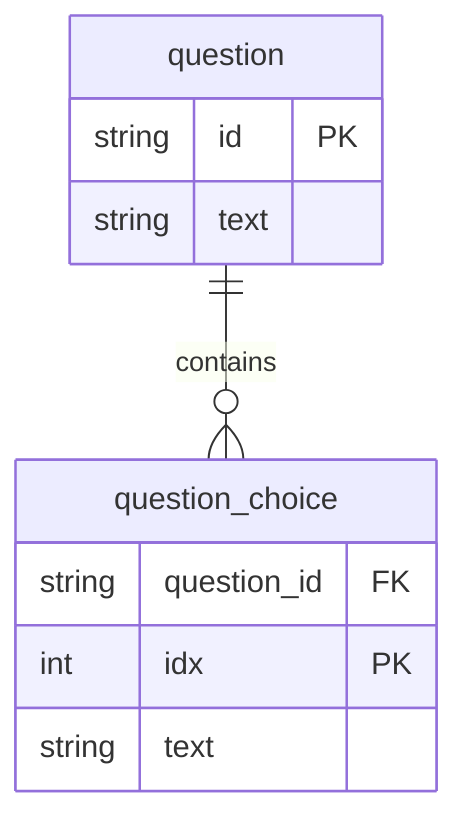

# List 매핑

## ERD



## 단순 값 List 매핑

```java
@Entity
@Table(name = "question")
public class Question {
    @Id
    private String id;
    private String text;

    @ElementCollection(fetch = FetchType.EAGER)
    @CollectionTable(
            name = "question_choice",
            joinColumns = @JoinColumn(name = "question_id")
    )
    @OrderColumn(name = "idx") // Set 과의 차이점. 0부터 시작됨.
    @Column(name = "text")
    private List<String> choices = new ArrayList<>();
}
```


### 저장

1. 실행 코드

   ```java
   Question q = new Question(id, "질문", List.of("보기1", "보기2"));
   em.persist(q);
   ```

2. 실제 실행되는 쿼리

   ```sql
   insert into question (text, id) values (?, ?)
   insert into question_choice(question_id, idx, text) values(?, ?, ?)
   insert into question_choice(question_id, idx, text) values(?, ?, ?)
   ```

   

### 조회 (Lazy)

Set과 동일하게 List를 사용할 때 조회.

### 조회 (Eager)

Set과 동일하게 처음부터 left join을 사용하여 불러옴.


### List를 아예 새로 할당

List를 불변의 요소처럼 다루려면 새로 할당하는 방법이 나을 수 있다. 다만 개별로 수정하는것도 가능하다.

1. 실행 코드

   ```java
   Question q = em.find(Question.class, id);
   q.setChoices(Set.of("보기1", "보기2")); // setChoices 시 아예 choices 컬렉션이 새로 할당.
   ```

2. 실행 쿼리

   ```sql
   delete from question_choice where question_id=?
   insert into question_choice(question_id, idx, text) values(?, ?, ?)
   insert into question_choice(question_id, idx, text) values(?, ?, ?)
   ```

   

### 삭제

1. 실행 코드

   ```java
   Question q = em.find(Question.class, id);
   em.remove(q)
   ```

2. 실행 쿼리

   ```sql
   delete from question_choice where question_id=?
   delete from question where id=?
   ```

   

## Embeddable Type List

```java
@Entity
@Table(name = "question")
public class Question {
    @Id
    private String id;
    private String text;

    @ElementCollection(fetch = FetchType.EAGER)
    @CollectionTable(
            name = "question_choice",
            joinColumns = @JoinColumn(name = "question_id")
    )
    @OrderColumn(name = "idx")
    private List<Choice> choices = new ArrayList<>();
}
```

```java
@Embeddable
@Access(AccessType.FIELD)
public class Choice {
    private String text;
    private boolean input;
}
```
