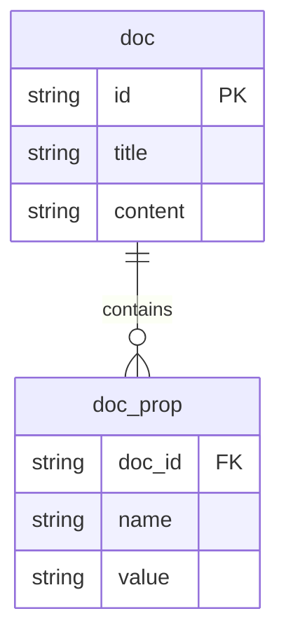

# Map 매핑

## ERD



## 단순 값 Map 매핑

```java
@Entity
@Table(name = "doc")
public class Document {
    @Id
    private String id;
    private String title;
    private String content;
    @ElementCollection
    @CollectionTable(
            name = "doc_prop",
            joinColumns = @JoinColumn(name = "doc_id")
    )
    @MapKeyColumn(name = "name") // Map의 Key에 해당되는 Column을 셋팅
    @Column(name = "value")
    private Map<String, String> props = new HashMap<>();
}
```


### 저장

1. 실행 코드

   ```java
   Map<String, String> props = new HashMap<>();
   props.put("p1","v1");
   props.put("p2","v2");
   Document doc = new Document(id, "제목", "내용", props);
   em.persist(doc);
   ```

2. 실제 실행되는 쿼리

   ```sql
   insert into doc (content, title, id) values (?, ?, ?)
   insert into doc_prop(doc_id, name, value) values(?, ?, ?)
   insert into doc_prop(doc_id, name, value) values(?, ?, ?)
   ```

   

### Map에 값 추가/수정/삭제

1. 실행 코드

   ```java
   Document doc = em.find(Document.class, id);
   doc.setProp("p1", "v1new");
   doc.setProp("p10", "v10");
   doc.removeProp("p2");
   ```

2. 실행 쿼리

   ```sql
   delete from doc_prop where doc_id=? and name=?
   update doc_prop set value=? where doc_id=? and name=?
   insert into doc_prop (doc_id, name, value) values (?, ?, ?)
   ```

   

## Embeddable Type Map

```java
@Entity
@Table(name = "doc")
public class Document {
    @Id
    private String id;
    private String title;
    private String content;
    @ElementCollection
    @CollectionTable(
            name = "doc_prop",
            joinColumns = @JoinColumn(name = "doc_id")
    )
    @MapKeyColumn(name = "name")
    private Map<String, PropValue> props = new HashMap<>();
}
```

```java
@Embeddable
@Access(AccessType.FIELD)
public class PropValue {
    private String value;
    private boolean enabled;
}
```
